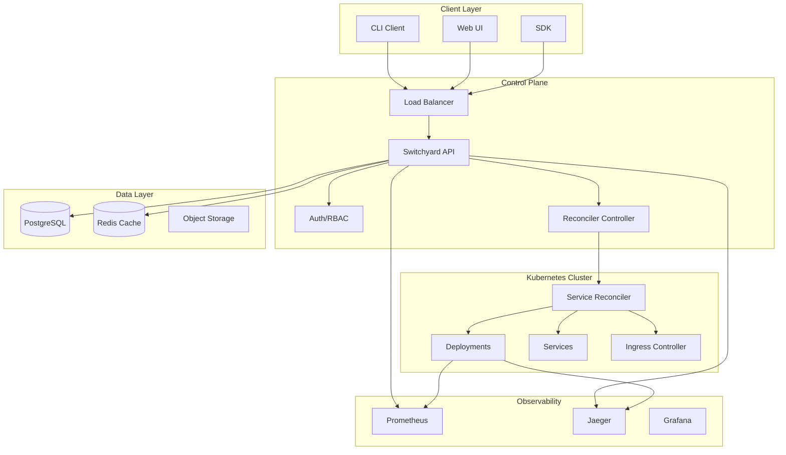
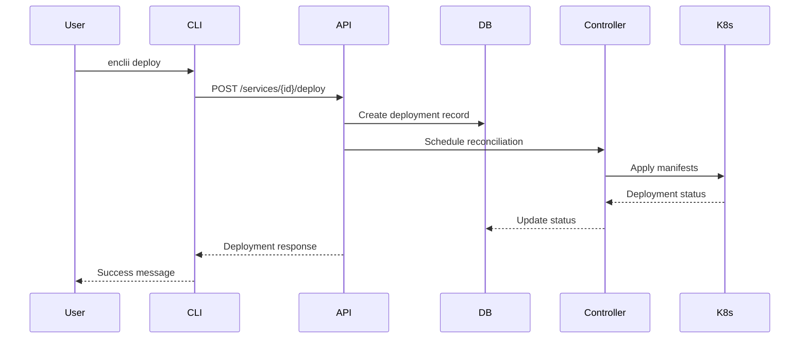
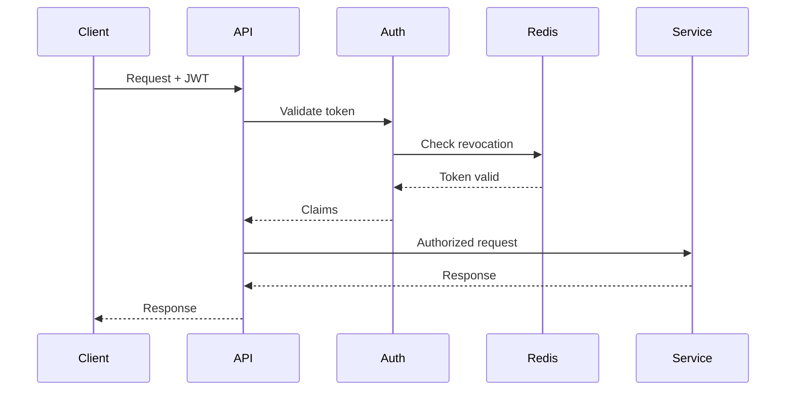

# Enclii Platform Architecture

## Table of Contents
- [Overview](#overview)
- [System Architecture](#system-architecture)
- [Core Components](#core-components)
- [Infrastructure Services](#infrastructure-services)
- [Security Architecture](#security-architecture)
- [Data Flow](#data-flow)
- [Deployment Architecture](#deployment-architecture)
- [Scalability & Performance](#scalability--performance)
- [Monitoring & Observability](#monitoring--observability)

## Overview

Enclii is a production-ready Platform-as-a-Service (PaaS) that provides Railway-style internal developer platforms with enterprise-grade security, scalability, and observability. Built on Kubernetes, it enables teams to deploy containerized services with comprehensive guardrails and operational excellence.

### Key Principles

- **Developer Experience First**: Simple CLI and intuitive web UI
- **Production Ready**: Enterprise security, monitoring, and reliability from day one
- **Cloud Native**: Kubernetes-native with cloud-agnostic design
- **Observable by Default**: Comprehensive metrics, logs, and tracing
- **Security in Depth**: Multiple layers of security controls

## System Architecture

## Core Components

### Switchyard API (Control Plane)

The central control plane managing all platform operations:

**Responsibilities:**
- RESTful API serving all client requests
- Authentication and authorization
- Service lifecycle management
- Build orchestration
- Deployment coordination
- Secret management

**Technology Stack:**
- Language: Go 1.22+
- Framework: Gin web framework
- Database: PostgreSQL with migration support
- Cache: Redis with tag-based invalidation
- Authentication: JWT with RSA signing

**Key Features:**
- Rate limiting (1000-10000 req/min based on environment)
- Connection pooling (10-50 connections)
- Circuit breaker pattern for external dependencies
- Structured logging with correlation IDs
- OpenTelemetry distributed tracing

### Reconciler System

Kubernetes operators managing service deployments:

**Components:**
- **Service Reconciler**: Manages Kubernetes deployments and services
- **Controller**: Orchestrates reconciliation loops with worker pools
- **State Manager**: Tracks desired vs actual state

**Reconciliation Flow:**
1. API receives deployment request
2. Creates deployment record in database
3. Controller schedules reconciliation
4. Reconciler ensures namespace exists
5. Generates Kubernetes manifests
6. Applies manifests to cluster
7. Monitors deployment status
8. Updates database with results

### Web UI (Switchyard UI)

Modern React-based dashboard for platform management:

**Technology:**
- Framework: Next.js 14 with App Router
- Styling: Tailwind CSS
- State Management: React hooks
- API Client: Fetch with authentication

**Features:**
- Real-time deployment status
- Project and service management
- Log streaming interface
- Metrics visualization
- Cost tracking dashboard

### CLI (Conductor)

Developer-friendly command-line interface:

**Commands:**
- `enclii init`: Scaffold new projects
- `enclii up`: Deploy preview environments
- `enclii deploy`: Production deployments
- `enclii logs`: Stream service logs
- `enclii scale`: Manage autoscaling

**Features:**
- OIDC authentication flow
- Progress indicators for long operations
- Structured output formats (JSON/table)
- Shell completion support

## Infrastructure Services

### Database Layer (PostgreSQL)

**Configuration:**
- High availability with streaming replication
- Connection pooling via PgBouncer
- Automated backups every 6 hours
- Point-in-time recovery capability

**Schema Management:**
- Automatic migrations via golang-migrate
- Version tracking in schema_migrations table
- Rollback support for failed migrations

### Caching Layer (Redis)

**Use Cases:**
- API response caching
- Session storage
- Rate limiting counters
- Deployment status cache

**Features:**
- Tag-based cache invalidation
- Configurable TTL (1800-7200 seconds)
- Redis Sentinel for HA in production
- Memory optimization with eviction policies

### Build System (Roundhouse)

**Build Pipeline:**
1. Source code checkout
2. Dependency resolution
3. Container image building (BuildKit)
4. Security scanning (Trivy)
5. Image signing (Cosign)
6. Registry push (ghcr.io)
7. SBOM generation (CycloneDX)

## Security Architecture

### Authentication & Authorization

**JWT Authentication:**
- RSA key pair signing (RS256)
- Token expiration (24 hours default)
- Refresh token rotation
- Revocation list support

**RBAC Implementation:**
- Roles: Admin, Developer, Viewer
- Project-level permissions
- Service-level access control
- API key support for CI/CD

### Network Security

**Network Policies:**
- Micro-segmentation between services
- Deny-all default with explicit allows
- Egress control for external APIs
- Pod-to-pod encryption via service mesh

**TLS Configuration:**
- TLS 1.3 minimum
- Certificate management via cert-manager
- Automatic certificate rotation
- mTLS for service communication

### Container Security

**Runtime Security:**
- ReadOnlyRootFilesystem enforced
- Non-root user execution (UID 65532)
- Dropped Linux capabilities
- Seccomp profiles enabled

**Image Security:**
- Vulnerability scanning on build
- Policy enforcement via OPA
- Signed images with Cosign
- SBOM attached to images

### Secret Management

**Lockbox Integration:**
- Encrypted at rest
- Versioned secrets
- Audit logging
- Rotation reminders

**Secret Types:**
- Database credentials
- API keys
- TLS certificates
- OAuth client secrets

## Data Flow

### Deployment Flow

### Request Authentication Flow

## Deployment Architecture

### Environment Strategy

**Development:**
- Single replica deployments
- Debug logging enabled
- Self-signed certificates
- Local file-based secrets

**Staging:**
- 3 replica deployments
- Info-level logging
- Let's Encrypt certificates
- Vault-based secrets

**Production:**
- 5+ replica deployments
- Warn-level logging
- Commercial CA certificates
- Hardware security module (HSM)

### High Availability

**Control Plane HA:**
- Multiple API replicas behind load balancer
- Database replication with automatic failover
- Redis Sentinel for cache HA
- Cross-AZ deployment

**Data Plane HA:**
- Multi-zone node pools
- Pod disruption budgets
- Automatic node recovery
- Cluster autoscaling

## Scalability & Performance

### Horizontal Scaling

**API Scaling:**
- CPU-based HPA (50% target)
- 2-10 replicas range
- 30-second scale-up delay
- 5-minute scale-down delay

**Service Scaling:**
- KEDA-based autoscaling
- Custom metrics support
- Scheduled scaling
- Predictive scaling (roadmap)

### Performance Optimizations

**Database:**
- Query optimization with indexes
- Prepared statement caching
- Connection pooling
- Read replicas for queries

**Caching:**
- Multi-layer caching strategy
- Edge caching via CDN
- Browser caching headers
- API response caching

**Build Performance:**
- Layer caching in builds
- Parallel build execution
- Distributed build cache
- Incremental builds

## Monitoring & Observability

### Metrics Collection

**Prometheus Metrics:**
- HTTP request rate/duration/errors
- Database connection pool metrics
- Cache hit/miss rates
- Kubernetes resource metrics

**Custom Metrics:**
- Deployment frequency
- Build success rate
- Mean time to recovery (MTTR)
- Service level objectives (SLOs)

### Distributed Tracing

**Jaeger Integration:**
- End-to-end request tracing
- Cross-service correlation
- Performance bottleneck identification
- Error root cause analysis

### Logging Architecture

**Structured Logging:**
- JSON format with metadata
- Correlation IDs across services
- Log levels per environment
- Sensitive data redaction

**Log Aggregation:**
- Centralized via Loki
- Real-time streaming
- Long-term retention (30 days)
- Query interface via Grafana

### Alerting

**Alert Rules:**
- Service down > 1 minute
- Error rate > 1%
- Response time P95 > 500ms
- Certificate expiry < 7 days

**Alert Channels:**
- PagerDuty integration
- Slack notifications
- Email alerts
- Webhook support

## Disaster Recovery

### Backup Strategy

**Database Backups:**
- Automated every 6 hours
- Cross-region replication
- 30-day retention
- Point-in-time recovery

**Configuration Backup:**
- GitOps with version control
- Encrypted secret backup
- Infrastructure as Code
- Automated restoration

### Recovery Procedures

**RTO/RPO Targets:**
- Recovery Time Objective: < 4 hours
- Recovery Point Objective: < 1 hour
- Automated failover: < 5 minutes
- Manual intervention: < 30 minutes

## Performance Baselines

### API Performance

| Endpoint | P50 | P95 | P99 |
|----------|-----|-----|-----|
| GET /health | 5ms | 10ms | 20ms |
| GET /projects | 50ms | 200ms | 500ms |
| POST /deploy | 500ms | 2s | 5s |
| GET /logs | 100ms | 500ms | 1s |

### Resource Utilization

| Component | CPU (avg) | Memory (avg) | Network (Mbps) |
|-----------|-----------|--------------|----------------|
| API Server | 30% | 60% | 10 |
| Database | 40% | 70% | 50 |
| Redis | 10% | 40% | 100 |
| Reconcilers | 20% | 30% | 5 |

## Technology Stack Summary

### Languages & Frameworks
- **Backend**: Go 1.22+, Gin, GORM
- **Frontend**: TypeScript, React 18, Next.js 14
- **Infrastructure**: Kubernetes 1.29+, Helm 3.14+

### Data Storage
- **Primary DB**: PostgreSQL 15+
- **Cache**: Redis 7+
- **Object Storage**: S3-compatible
- **Container Registry**: ghcr.io

### Observability
- **Metrics**: Prometheus + Grafana
- **Tracing**: OpenTelemetry + Jaeger
- **Logging**: Structured JSON + Loki
- **Alerting**: AlertManager + PagerDuty

### Security
- **Authentication**: JWT with RSA
- **Authorization**: RBAC
- **Secrets**: Vault/1Password
- **Scanning**: Trivy, Cosign

### CI/CD
- **VCS**: GitHub
- **CI**: GitHub Actions
- **CD**: ArgoCD (GitOps)
- **Registry**: GitHub Container Registry

## Related Documentation

- **Getting Started**: [Quick Start Guide](/docs/getting-started/QUICKSTART) | [Development Guide](/docs/getting-started/DEVELOPMENT)
- **Infrastructure**: [Infrastructure Overview](/docs/infrastructure/) | [GitOps](/docs/infrastructure/GITOPS) | [Storage](/docs/infrastructure/STORAGE)
- **CLI**: [CLI Reference](/docs/cli/) | [Deploy Command](/docs/cli/commands/deploy)
- **SDKs**: [TypeScript SDK](/docs/sdk/typescript/) | [Go SDK](/docs/sdk/go/)
- **Troubleshooting**: [API Errors](/docs/troubleshooting/api-errors) | [Deployment Issues](/docs/troubleshooting/deployment-issues)
- **Security**: [Security FAQ](/docs/faq/security) | [Security Audit](/docs/audits/security/EXECUTIVE_SUMMARY)
- **API Reference**: [OpenAPI Documentation](/api-reference/)

---

*Last Updated: January 2026*
*Version: 1.0.0*
*Status: Production Ready*